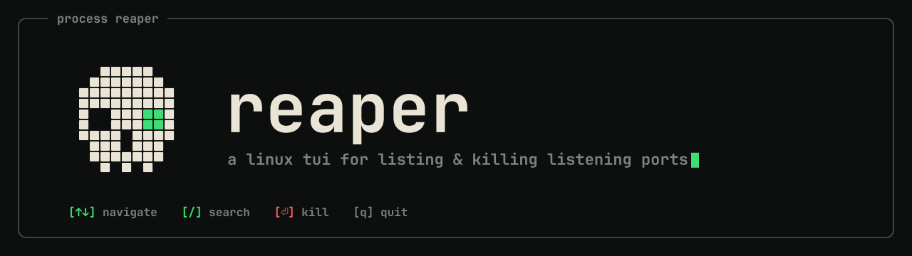

<div align="center">
  
  <p><a href="https://reaper.aymenkrifa.com"><b>reaper.aymenkrifa.com</b></a></p>
</div>

# reaper

A linux TUI for listing and killing listening ports.

I made this small tool because I can never remember the exact `lsof` command and flags needed to see what's listening on which ports. It reads `/proc` directly, so it doesn't need `lsof` at all.

## Features

- **Every listener in one table** — port, user, memory, uptime, protocol, pid and command
- **Kill from the list** — select a row, press `⏎`, confirm. Nothing dies without a yes.
- **Graceful by default** — sends `SIGTERM` first and only escalates to `SIGKILL` if the process ignores it, then reports which one actually did it
- **Search and sort** — filter as you type, sort by any of the seven columns in either direction
- **Other users' listeners** — hidden by default, one key to reveal (run with `sudo` to kill them)
- **Live** — the list refreshes every second, and holds still while a confirmation is open
- **No dependencies** — no `lsof`, no `netstat`, just `/proc`

## Install

Reaper is Linux-only (it reads `/proc` directly). To see and kill processes owned by other users, run it with `sudo`.

**From Releases** (no Rust needed — static binary, works on any distro):

```bash
curl -fsSL https://github.com/aymenkrifa/reaper/releases/latest/download/reaper-x86_64-unknown-linux-musl.tar.gz | tar -xz
sudo install reaper /usr/local/bin/
```

For ARM machines, replace `x86_64` with `aarch64`. All builds and checksums are on the [Releases page](https://github.com/aymenkrifa/reaper/releases).

**With Cargo** (requires Rust 1.85+):

```bash
cargo install --git https://github.com/aymenkrifa/reaper --locked
```

**From source:**

```bash
git clone https://github.com/aymenkrifa/reaper.git
cd reaper
cargo install --path . --locked
```

## Docs

Keys, the interface, and everything else live at **[reaper.aymenkrifa.com](https://reaper.aymenkrifa.com)** — one place, kept current.

## License

MIT License - see [LICENSE](LICENSE) file.

## Acknowledgements

Inspired by [gruyère](https://github.com/savannahostrowski/gruyere) by Savannah Ostrowski, built in Go. This project was built as a learning experience to explore Rust.
